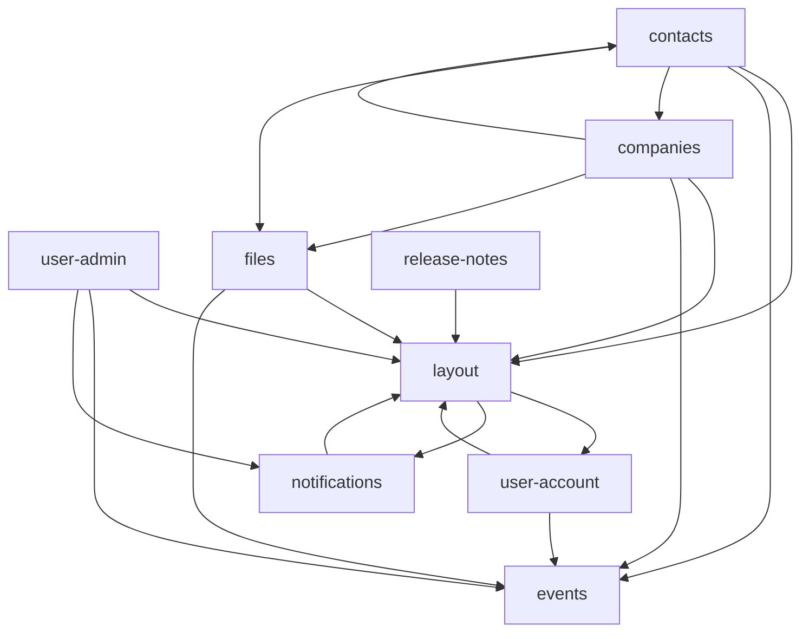

# Lowdefy modules — MongoDB

A set of reusable [Lowdefy](https://lowdefy.com) modules backed by MongoDB. Drop them into a Lowdefy app to get authentication, user admin, contacts, companies, file attachments, audit events, and notifications without writing the YAML for each.

The repo is for app builders who already use Lowdefy and want a curated set of modules that work together — shared change stamps, shared event collection, shared layout — instead of assembling them piece by piece.

> **Prerelease.** This repo is in a prerelease state (0.x). Breaking changes can land in any minor release. Pin to an exact version or commit SHA in production and review the changelog before upgrading.

## Modules

| Module | One-liner |
|---|---|
| [layout](modules/layout/README.md) | Page wrapper — header, sider, menu, profile, notifications, dark mode, auth pages |
| [events](modules/events/README.md) | Audit event log — `new-event` API, timeline panel, `change_stamp` template |
| [files](modules/files/README.md) | File attachments backed by S3 — upload, download, file cards, file lists |
| [notifications](modules/notifications/README.md) | Bell, inbox, deep-link routing, configurable send routine |
| [user-account](modules/user-account/README.md) | Login, email verification, profile view/edit/create |
| [user-admin](modules/user-admin/README.md) | User administration — list, edit, invite |
| [contacts](modules/contacts/README.md) | Contact management — list, detail, edit, create, selector |
| [companies](modules/companies/README.md) | Company management — list, detail, edit, create, selector |
| [release-notes](modules/release-notes/README.md) | Render `CHANGELOG.md` as a release-notes page |

## Dependency graph



A few notes on the shape:

- `events` has no dependencies — every other module either logs events or carries a change stamp, so it sits at the bottom of the graph.
- `layout` depends on `user-account` and `notifications` because the page chrome integrates the profile dropdown and the notification bell. Those modules in turn depend on `layout` for their own pages — the cycle is intentional and resolved at runtime.
- `contacts` and `companies` depend on each other for selectors and bidirectional links. Same story — runtime cycle, by design.
- Dependencies are **not** installed transitively. Declaring `dependencies:` in a manifest tells the build how to wire cross-module references — it does not pull modules in. Every module you use must be added as its own entry in `lowdefy.yaml`. So adding `companies` means also adding entries for `layout`, `events`, `contacts`, and `files` (and their dependencies in turn).

## What to use when

| You need… | Add… |
|---|---|
| A login page and a profile page | `layout`, `events`, `user-account` |
| To invite and manage users | + `user-admin`, `notifications` |
| A bell and inbox for in-app messages | + `notifications` |
| Contact management with company links | + `contacts`, `companies`, `files` |
| File attachments on any entity | + `files` |
| An audit log on writes anywhere in the app | + `events` (most other modules already log) |
| A release-notes page from `CHANGELOG.md` | + `release-notes` |

The minimum set for an authenticated app is `layout` + `events` + `user-account` + `notifications`. Everything else is opt-in.

## Using modules in an app

Modules are added to the `modules` array in `lowdefy.yaml`:

```yaml
modules:
  - id: events
    source: "github:lowdefy/modules-mongodb/modules/events@v0.2.0"
    vars:
      display_key: my-app

  - id: layout
    source: "github:lowdefy/modules-mongodb/modules/layout@v0.2.0"
    vars:
      logo:
        primary_light: /logo.png

  - id: user-account
    source: "github:lowdefy/modules-mongodb/modules/user-account@v0.2.0"
    vars:
      app_name: my-app

  - id: notifications
    source: "github:lowdefy/modules-mongodb/modules/notifications@v0.2.0"
    vars:
      app_name: my-app
```

Each entry pins a `source` (GitHub ref or local `file:` path), passes `vars`, and optionally remaps `dependencies` and `connections` when entry IDs don't match the names declared in the module manifest. See <https://docs.lowdefy.com/modules> for the full module-system reference.

Per-module READMEs cover the vars, exports, and a worked example for each module. [`docs/idioms.md`](docs/idioms.md) covers the shared patterns (`change_stamp`, `event_display`, slot vars, `app_name`, avatar colors, secrets) that most modules use.

## See it in action

`apps/demo/` wires every module together against MongoDB. It's the canonical worked example — match its `vars.yaml` files in `apps/demo/modules/{module}/vars.yaml` for each module's input.

## Plugins

Some modules require [`@lowdefy/modules-mongodb-plugins`](plugins/modules-mongodb-plugins/README.md), a peer plugin package shipped from this repo with custom blocks (ContactSelector, EventsTimeline, FileManager, SmartDescriptions) and a `FetchRequest` action.

## Versioning

Releases are tagged in this repo. Pin module sources to a specific tag (`@v1.2.0`) — pinning to a branch will pull whatever is on that branch at build time. Release notes live in [`CHANGELOG.md`](CHANGELOG.md).
