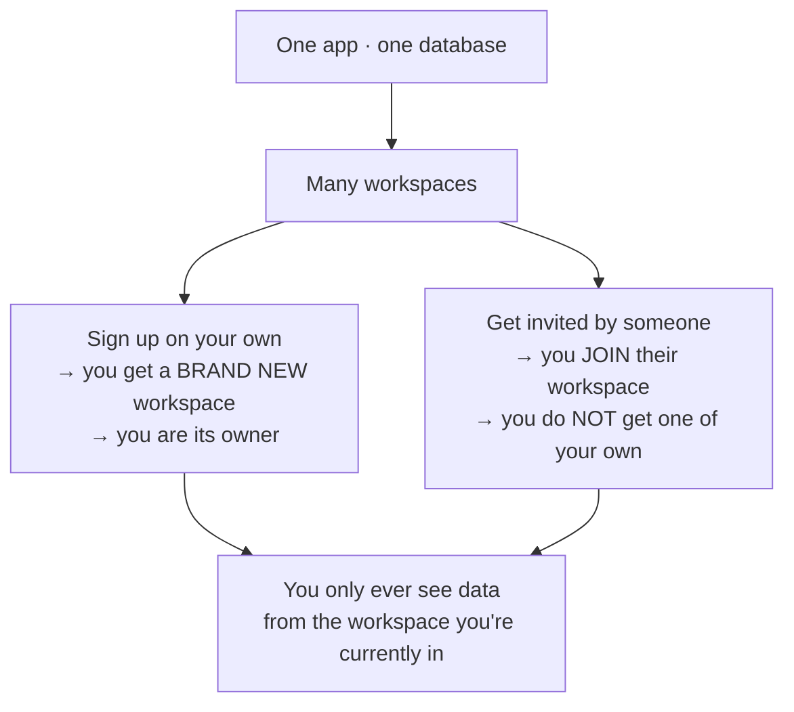
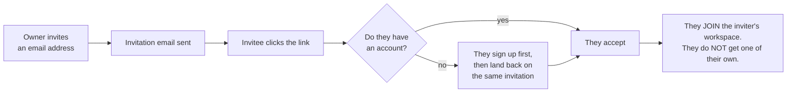
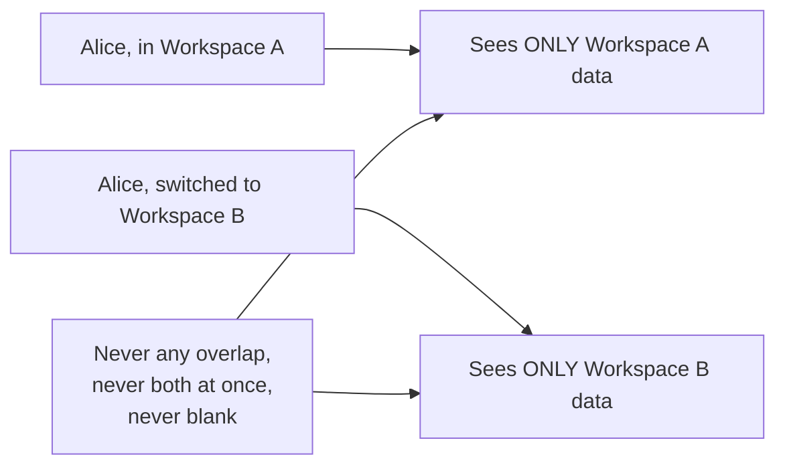

# QA Test Plan — Sign-in, Accounts & Workspaces

A test pass for the rebuilt sign-in system and the new **workspaces** feature.
Sections 1–6 need no coding — just browsers and inboxes. Section 7 is the
developer half of the same pass: repo and database in hand. Work top to
bottom — later sections depend on accounts you create earlier.

Tick each box. If something doesn't match the **Expect** line, note it and move
on (see [Reporting a problem](#reporting-a-problem) at the end).

---

## What you're testing

The app has been rebuilt so that **one app can serve many separate customers at
once**, each in their own **workspace**. The rules:

1. **Signing up creates a workspace.** Sign up on your own and you get a fresh,
   empty workspace with you as the owner.
2. **Being invited joins an existing one.** Accept an invitation and you join
   that person's workspace instead of getting your own.
3. **You can belong to more than one.** A switcher in the top bar changes which
   one you're looking at.
4. **Workspaces must never see each other's data.** This is the most important
   thing in this document. Section 5 is entirely about it.

> **Vocabulary:** the app sometimes says "organization" where this document says
> "workspace". Same thing.

---

## Before you start

**You need:**

- The app URL, and a login for nothing yet (you'll create all accounts yourself).
- **4 email addresses you can actually read.** Real inboxes or catch-all
  addresses — several tests depend on clicking links in emails. Gmail's
  `you+a@gmail.com` trick works fine.
- Two browsers, or one browser plus a private/incognito window. Several tests
  need two people signed in at once.
- A phone with an authenticator app (Google Authenticator, 1Password, Authy) for
  the two-factor tests.

**Fill this in as you go** — later sections refer back to it:

| Label     | Email | Password | Workspace they own | Notes                             |
| --------- | ----- | -------- | ------------------ | --------------------------------- |
| **Alice** |       |          | Workspace A        | Owner. Ends up in two workspaces. |
| **Bob**   |       |          | Workspace B        | Owner of a separate workspace.    |
| **Carol** |       |          | _(none — invited)_ | Invited into Workspace A.         |
| **Dave**  |       |          | _(none — invited)_ | Invited into **both** workspaces. |

---

## Section 1 — Getting in

### 1.1 Sign up

- [ ] Go to `/user-account/signup`. Sign up as **Alice**.
- [ ] **Expect:** a "check your email" message. You are **not** signed in yet.
- [ ] Check Alice's inbox.
- [ ] **Expect:** a verification email that looks properly designed — the app's
      colours and logo, not plain text.
- [ ] Click the link in the email.
- [ ] **Expect:** a success page with a way to continue to sign-in.
- [ ] Sign in as Alice.
- [ ] **Expect:** you land in the app.

### 1.2 The sign-up form's other paths

- [ ] Sign up with an email you've already used.
- [ ] **Expect:** a clear message. Not a blank page, not a raw error code.
- [ ] Sign up with a password shorter than 8 characters.
- [ ] **Expect:** it's rejected with a readable message.
- [ ] Request the verification email again from the "check your email" screen.
- [ ] **Expect:** a second email arrives and its link works.
- [ ] Wait for a verification link to expire (or use an old one), then click it.
- [ ] **Expect:** an "expired" message **with a button to send a new one**.

### 1.3 Signing in

- [ ] Sign out, then go to `/user-account/login` directly (type the URL).
- [ ] Sign in.
- [ ] **Expect:** you land on the app's home page. **You must not be left sitting
      on the login form.**
- [ ] Sign out. Try to open a page that needs sign-in (e.g.
      `/organizations/members`).
- [ ] **Expect:** you're sent to the login page. After signing in, you land on
      **the page you originally asked for**.
- [ ] Sign in with the wrong password.
- [ ] **Expect:** "incorrect email or password" style message, shown on the form.
- [ ] Sign in with an account that never verified its email.
- [ ] **Expect:** a message telling you to verify. _(Known gap — see
      [Known issues](#known-issues) K1.)_

### 1.4 Sign in with an email link (no password)

- [ ] On the login page, use **"Email me a link"** with Alice's address.
- [ ] **Expect:** a "check your email" state with a resend option and a way back
      to the password form.
- [ ] **Expect:** a properly designed email arrives.
- [ ] Click the link.
- [ ] **Expect:** you're signed in.
- [ ] Click the **same link a second time**.
- [ ] **Expect:** a readable error. Not a blank screen.

### 1.5 Forgot password

- [ ] Use "Forgot password?" with Alice's address. Note the message.
- [ ] Now use it with an address that **doesn't exist**.
- [ ] **Expect: exactly the same message both times.** If the app reveals which
      addresses exist, that's a bug — report it.
- [ ] Complete the reset from the email.
- [ ] **Expect:** the old password no longer works; the new one does.
- [ ] Click the same reset link again.
- [ ] **Expect:** a readable "already used / expired" message.

### 1.6 Two-factor authentication

- [ ] Signed in as Alice, go to `/user-account/view` → the security area →
      set up two-factor.
- [ ] **Expect:** a QR code you can scan with your authenticator app.
- [ ] Finish setup and **save the backup codes somewhere.**
- [ ] Sign out. Sign in again with email + password.
- [ ] **Expect:** you're asked for a 6-digit code before you get in.
- [ ] Enter a wrong code.
- [ ] **Expect:** an error, you stay on the page, and you are **not** signed in.
- [ ] Enter the correct code.
- [ ] **Expect:** you're signed in.
- [ ] Sign out, sign in, and this time use **"use a backup code"** with one of
      your saved codes.
- [ ] **Expect:** it works, and that same code does **not** work a second time.
- [ ] Sign in again and tick "trust this device".
- [ ] **Expect:** the next sign-in on that browser skips the code.

### 1.7 Passkeys and Google sign-in

- [ ] In the account security area, add a **passkey** (Touch ID, Windows Hello,
      phone).
- [ ] Sign out and sign in using the passkey button.
- [ ] **Expect:** you're signed in with no password typed.
- [ ] Delete the passkey from the security area.
- [ ] **Expect:** it disappears from the list and no longer works for sign-in.
- [ ] **Expect:** a **Google** button appears on the login page. _(It may not be
      fully configured on the test environment — check with the developer before
      reporting it.)_

### 1.8 Signing out

- [ ] Sign out from the profile menu.
- [ ] **Expect:** you end up somewhere sensible (login page), and pressing the
      browser **Back** button does not put you back inside the app.

---

## Section 2 — Your first workspace

### 2.1 A new sign-up gets its own workspace

- [ ] As **Alice** (first sign-in), look at the **top bar**.
- [ ] **Expect:** a workspace name is shown. It will be named after Alice —
      that's correct for a brand-new workspace.
- [ ] **Expect:** there is **no** "create a workspace" button anywhere in the
      app. Workspaces are only created by signing up or by invitation.

### 2.2 Completing your profile

- [ ] On first sign-in as a new user you should be sent to a profile page before
      you can use the app.
- [ ] Fill it in and save.
- [ ] **Expect:** you're taken into the app. **You must not be left sitting on
      the profile page.**
- [ ] **Expect:** your name and avatar appear in the top bar **immediately**,
      without a page refresh.
- [ ] Sign out and back in.
- [ ] **Expect:** you go straight into the app — not back to the profile page.

### 2.3 Renaming the workspace

- [ ] Go to `/organizations/settings`. Rename Workspace A to something obvious
      like "Alice Test Co".
- [ ] **Expect:** the new name appears in the top bar.
- [ ] **Expect:** it appears on `/organizations/members` too.

### 2.4 Editing your profile later

- [ ] Go to `/user-account/view` and change your name and avatar.
- [ ] **Expect:** the top bar updates **immediately**, no refresh needed.
- [ ] Refresh the page.
- [ ] **Expect:** the change is still there.

### 2.5 Your sessions

- [ ] Sign in as Alice in a **second** browser so there are two active sessions.
- [ ] In the first browser, go to the account page's session list.
- [ ] **Expect:** you see both sessions with dates and rough device info.
- [ ] Use **"sign out other sessions"**.
- [ ] **Expect:** the second browser is signed out on its next action.

---

## Section 3 — Inviting people

### 3.1 Send an invitation

- [ ] As Alice, go to `/organizations/members` and invite **Carol**.
- [ ] **Expect:** Carol appears in a **pending invitations** list with an expiry
      date.
- [ ] **Expect:** a properly designed invitation email arrives in Carol's inbox,
      naming Alice's workspace, with a working button.
- [ ] **Expect:** Carol already shows up in the app's **contact lists** for
      Workspace A, even though she hasn't accepted yet. _(This is intended.)_

### 3.2 Accept it

- [ ] Open Carol's invitation link **in a fresh private window** (not signed in).
- [ ] **Expect:** a page naming the workspace and who invited her, offering
      sign-up / sign-in.
- [ ] Sign up as Carol from that page.
- [ ] **Expect:** after verifying and signing in, she comes **back to the
      invitation**, not to a generic home page.
- [ ] **Expect:** her email address is already filled in and she can't
      accidentally change it.
- [ ] Accept.
- [ ] **Expect:** she lands in the app, **inside Alice's workspace**.
- [ ] **Expect:** Carol's top bar shows **Alice's workspace name**, and she has
      **no workspace of her own**.
- [ ] **Expect:** Carol now appears in Alice's members list, no longer in
      pending invitations.

**Then, without signing out** — this is the part that used to break, so please do
it in this exact order:

- [ ] **Expect:** Carol is sent to the profile page (§2.2), and whatever Alice
      typed when inviting her is **already filled in**.
- [ ] Fill in the rest and save.
- [ ] **Expect:** it saves first time and takes her into the app. If saving fails
      here, or she cannot get off the profile page without signing out and back
      in, that is the bug — please report it.
- [ ] In Alice's members list, check Carol's row.
- [ ] **Expect:** her name is the one **she** just saved, not blank and not
      something from another workspace.

### 3.3 The awkward invitation cases

Each of these should give a clear, friendly message — never a blank page or a
raw error.

- [ ] Open Carol's now-used invitation link again.
- [ ] **Expect:** "you're already a member" and a way into the app.
- [ ] While signed in as **Bob**, open an invitation addressed to **Carol**.
- [ ] **Expect:** a "this invitation isn't for you" style message with a way out.
- [ ] Open an invitation link with the id removed or mangled.
- [ ] **Expect:** a clear message, not a crash.
- [ ] Ask the developer for an expired invitation, then open it.
- [ ] **Expect:** an "expired" message.

### 3.4 Cancel and re-invite

- [ ] Invite a fresh address, then **cancel** the pending invitation.
- [ ] **Expect:** it disappears from the pending list, and the emailed link no
      longer works.
- [ ] Invite the same address again.
- [ ] **Expect:** a new email, and **exactly one** pending row in the list — not
      two.

### 3.5 Managing members

- [ ] In Alice's members list, change Carol's role.
- [ ] **Expect:** the list updates and the change survives a refresh.
- [ ] Change **your own** role to something else.
- [ ] **Expect:** menus/pages you can reach change **immediately**, without a
      refresh.
- [ ] Try to remove **yourself** as the only owner, or leave the workspace as the
      only owner.
- [ ] **Expect:** the app refuses. A workspace must always keep an owner.
- [ ] Remove Carol.
- [ ] **Expect:** she disappears from the list. Sign in as Carol.
- [ ] **Expect:** Carol no longer has access to Workspace A.
- [ ] **Expect:** nowhere in this page can you set someone to **owner**. That's
      intentional.

---

## Section 4 — Belonging to two workspaces

This is what makes the switcher appear. **Do this section in order.**

- [ ] Sign up **Bob** from scratch (Section 1.1 again, new email).
- [ ] **Expect:** Bob gets his **own** brand-new workspace, named after him.
- [ ] **Expect:** Bob's top bar shows just a workspace name — **no dropdown**,
      because he only belongs to one.
- [ ] As **Bob**, invite **Alice's** email address into Workspace B.
- [ ] As Alice, accept Bob's invitation.
- [ ] **Expect:** Alice's top bar now has a **dropdown** listing both workspaces.
- [ ] **Expect: Alice is still looking at Workspace A** right after accepting.
      Accepting must not silently move her into Bob's workspace.

Now the switcher itself:

- [ ] As Alice, switch to Workspace B using the dropdown.
- [ ] **Expect:** the workspace name in the top bar changes, and the page
      contents change with it.
- [ ] **Refresh the page.**
- [ ] **Expect:** you're still in Workspace B. The switch must survive a refresh.
- [ ] Open a second tab.
- [ ] **Expect:** both tabs agree on which workspace you're in.
- [ ] Switch back to Workspace A.
- [ ] **Expect:** everything switches back.

Alice's profile in each workspace — she is one person, but each workspace keeps its
own record of her, so this is worth being fussy about:

- [ ] In **Workspace B**, go to `/user-account/view` and change Alice's name to
      something obviously different, e.g. "Alice in B". Save.
- [ ] **Expect:** it saves first time. A failure to save here is the bug this
      section exists for — please report it.
- [ ] Switch to **Workspace A**.
- [ ] **Expect:** Alice's name there is still her original one. Her Workspace B
      edit must not have followed her across.
- [ ] Check Alice's row in each workspace's members list.
- [ ] **Expect:** each shows that workspace's version of her name.

---

## Section 5 — Data separation (the most important section)

**Every list in the app must show only the workspace you're currently in.**

The failure to watch for is subtle: a list showing **the wrong workspace's rows**
is an obvious bug, but a list showing **nothing at all** is also a bug — it
usually means the separation is misconfigured. Treat an unexpectedly empty list
as a finding, not as "there's no data yet".

### 5.1 Set up recognisable data

- [ ] In **Workspace A**, create one of each with an obvious name like
      **"AAA Test"**: a contact, a company, an activity, a deal.
- [ ] Switch to **Workspace B**. Create the same set named **"BBB Test"**.

### 5.2 Check every list, in both workspaces

For each surface below: view it in Workspace A, then switch and view it in
Workspace B.

**Expect every time:** only that workspace's rows. Never the other's. Never
empty when you know you just created something.

| #     | Where to look                                    | A shows only AAA? | B shows only BBB? |
| ----- | ------------------------------------------------ | ----------------- | ----------------- |
| 5.2.1 | Contacts list                                    | ☐                 | ☐                 |
| 5.2.2 | Companies list                                   | ☐                 | ☐                 |
| 5.2.3 | Activities list                                  | ☐                 | ☐                 |
| 5.2.4 | Deals list                                       | ☐                 | ☐                 |
| 5.2.5 | Members list (`/organizations/members`)          | ☐                 | ☐                 |
| 5.2.6 | Notifications / inbox                            | ☐                 | ☐                 |
| 5.2.7 | Files list                                       | ☐                 | ☐                 |
| 5.2.8 | Workflows / actions                              | ☐                 | ☐                 |
| 5.2.9 | Any activity or history **timeline** on a record | ☐                 | ☐                 |

### 5.3 The easy-to-forget places

These use different machinery and are the most likely to leak.

- [ ] **Search boxes.** Type "AAA" in the contacts, companies, and activities
      search while in Workspace A. Then search "BBB" from Workspace A.
- [ ] **Expect:** AAA found, BBB **not** found. Then repeat the reverse from
      Workspace B.
- [ ] **Expect:** search results also look sensibly ordered — the best matches
      near the top, not random.
- [ ] **Excel / download buttons** on contacts and companies.
- [ ] **Expect:** the downloaded file contains **only** the current workspace's
      rows. Open the file and check.
- [ ] **Dropdown pickers** — e.g. edit a company and open its contacts field;
      edit a record and open a "parent company" picker.
- [ ] **Expect:** only the current workspace's options appear as you type.
- [ ] **Company hierarchy.** In Workspace A, try to set a Workspace B company as
      a parent.
- [ ] **Expect:** it isn't offered and can't be found.

### 5.4 The same email in two workspaces

- [ ] As **Alice** (Workspace A), invite **Dave**.
- [ ] As **Bob** (Workspace B), invite **the same Dave address**.
- [ ] **Expect:** both invitations work. Neither blocks the other.
- [ ] Have Dave accept **both**.
- [ ] **Expect:** Dave appears as a member in **both** workspaces, and in each
      one's contact list.
- [ ] **Expect:** Alice editing Dave's details in Workspace A does **not** change
      what Bob sees in Workspace B.

### 5.5 Reaching across the boundary on purpose

- [ ] While in Workspace A, copy a URL that contains a record id (e.g. a contact
      or company detail page). Switch to Workspace B and paste that URL.
- [ ] **Expect:** the record is **not** shown. An empty page or a clear "not
      found" is correct. Seeing the record is a **serious bug — report it
      immediately.**
- [ ] Repeat with a members-page URL and a deal URL.

### 5.6 Emails land in the right workspace

- [ ] Do something in Workspace A that sends a notification.
- [ ] **Expect:** it appears in Workspace A's inbox only, not Workspace B's.

---

## Section 6 — Things that must NOT work

Everything here is **supposed to fail**. If any of it succeeds, stop and report
it as high priority.

### 6.1 The Admin section

The **Admin → User Admin** menu (`/user-admin/all`) is a suite-wide tool that
does not belong in this multi-workspace setup. It is still in the build on
purpose.

- [ ] Open it (you may need the developer to give your account the "User Admin"
      role from the members page).
- [ ] **Expect:** the list loads and shows **only your current workspace's**
      people.
- [ ] Now try **every** button on it: Suspend, Reinstate, Remove, Delete, "View
      as user", sign out sessions, saving roles, saving attributes, inviting.
- [ ] **Expect: every one of them refuses with an error.** None may succeed.
- [ ] **Note down how each refusal looks.** A blank popup or a button that
      appears to work but silently does nothing is worth reporting even though
      the action was correctly blocked.

> A **Suspend** that actually works here would lock someone out of _every_
> workspace in the system. That's the single worst outcome in this document — if
> any Suspend succeeds, report it immediately and stop testing that area.

### 6.2 Acting on another workspace's people

- [ ] As Bob, ask the developer for a member id from Workspace A. Try to remove
      that person or change their role while Workspace B is active.
- [ ] **Expect:** refused.
- [ ] As an ordinary member (not owner or admin) — use Carol — try to reach the
      invite form and the workspace settings page.
- [ ] **Expect:** either the controls aren't offered, or the action is refused if
      forced. Report anything that goes through.

---

## Section 7 — Developer checks (repo + database access)

The half of the pass a browser can't do: config edits, direct database reads,
and deliberate breakage with a "then revert" step. Run against the same
environment as sections 1–6 (`apps/tenant-demo`, a real Atlas cluster), except
7.5, which runs against the pinned `apps/demo`.

**Don't hand-test what the machines already prove:** per-resolver two-org
isolation and every wall refusal/audit error path (lowdefy `connection-mongodb`
suite), two-org isolation through real pages
(`apps/tenant-demo/e2e/org-scoping/`), and the compiled shape of every authored
clause (`ldf:b` build artifacts). This section is only what needs a live Atlas,
real sessions, or a hand on the database.

**Prerequisite:** Atlas Search indexes per `docs/shared/org-scoping.md` on
`user-contacts`, `companies`, `activities` — `organizationId` statically mapped
as `token`, and in `storedSource` for `user-contacts` and `companies`. Blank
list pages with data present = an index gap, fail-closed by design (also
re-check 5.2's lists after fixing).

### 7.1 The audit refuses a missing clause (once, then revert)

- [ ] Remove the shared-fragment `_ref` from `get_all_contacts.yaml`'s
      `compound.filter` concat. Redeploy. Load the contacts list.
- [ ] **Expect:** a loud request error ("has no compound.filter equals
      clause…"), **not** a blank list — the wall audits authored clauses on
      every run. Restore the ref.

### 7.2 The preflight refuses unstamped rows (once, then revert)

- [ ] Insert one document without `organizationId` into a walled collection
      (e.g. `companies`). Restart the server.
- [ ] **Expect:** every request refused with "Tenant preflight refused to
      serve the app: collection …" naming the collection. Remove the document,
      restart, confirm it serves again.

### 7.3 The signup mint, on disk

After a fresh open signup → verify → first login (section 1.1 gives you one):

- [ ] The new `user-contacts` row carries `organizationId` = the caller's
      workspace id **and** `userId` = the auth user id.
- [ ] The `users` row has **no** `profile.contactId` — the link lives on the
      contact, not the user.
- [ ] Sign in a second time. **Expect:** no new contact row, and the existing
      row's `updated` stamp unchanged (the every-login hook writes nothing once
      linked).

### 7.4 Search behaves under the authored wall

- [ ] Contacts, companies, and activities search boxes filter, and result
      ordering looks relevance-ranked — the authored organization clause is a
      `filter`, so it must not affect scoring.
- [ ] Excel exports on contacts and companies download rows (their pipelines
      are operator-composed, so the runtime audit is their only gate).

### 7.5 Pinned smoke (`apps/demo`)

The wall is inert under `pinned` — two facts worth one look each:

- [ ] List pages, exports, and the ContactSelector work against an Atlas Search
      index **without** the `organizationId` token mapping or `storedSource`
      entry (the pinned index shape).
- [ ] A fresh signup's minted `user-contacts` row carries `userId` but **no**
      `organizationId`.

---

## Known issues — please don't report these

These are already logged. Confirm they still behave as described, then move on.

| #   | Where                  | What you'll see                                                                                                                                                                |
| --- | ---------------------- | ------------------------------------------------------------------------------------------------------------------------------------------------------------------------------ |
| K1  | Login page (1.3)       | An unverified user is told to check their inbox, but there's **no button to resend** the email. Dead end if the email is gone.                                                 |
| K2  | Login page (1.4)       | The password form and the "email me a link" button both show at once — looks cluttered. Known design question.                                                                 |
| K3  | Any page after sign-in | Occasionally the next page sticks on a "building page" screen. **Opening the same URL in a new tab clears it.** Test-environment only.                                         |
| K4  | 2FA backup codes (1.6) | The "Copy" button **closes the popup**, and the codes are only ever shown once. Save them manually first.                                                                      |
| K5  | 2FA setup popup (1.6)  | Cramped spacing; a "Confirm & enable" button appears before you've generated the QR code and errors if pressed; the password you typed is still there if you close and reopen. |
| K6  | Admin section (6.1)    | Roles that are no longer configured show as blank tags, and saving errors. In this setup the save refuses anyway.                                                              |
| K7  | Admin section (6.1)    | Every write button failing is **expected** — see 6.1. Only report a button that _succeeds_, or a refusal that's confusing.                                                     |

---

## If you only have one day

In priority order:

1. **Section 5** — data separation. All of it.
2. **Section 6.1** — confirm every Admin write refuses.
3. **Section 3** — invite and accept, end to end, including saving the profile
   straight after accepting without signing out.
4. **Section 4** — the switcher, including the refresh test and Alice's profile in
   each workspace.
5. **Sections 1.1–1.3** — sign up, verify, sign in.

---

## Reporting a problem

For each finding, note:

1. **Which test number** (e.g. "5.3, Excel download").
2. **Which account** you were signed in as, and **which workspace** was active.
3. **What you expected** vs **what happened.**
4. A **screenshot**, and the **URL** from the address bar.
5. Whether it happens **every time** or just once.

**Report these straight away rather than finishing the section:**

- Any data from one workspace visible in another (Section 5).
- Any Admin write that succeeds (Section 6.1).
- A list that is empty when you know you just created data in it.
- Being able to sign in as someone else, or reach a page after signing out.
